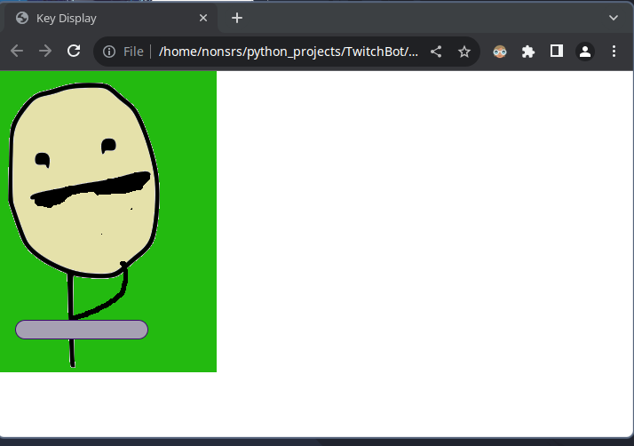
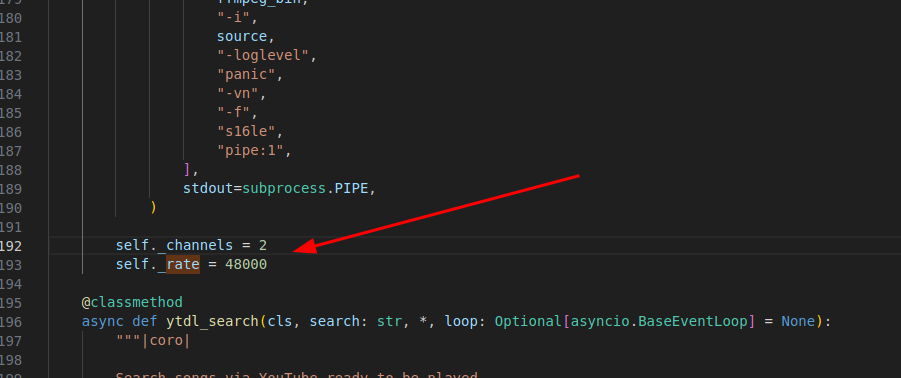
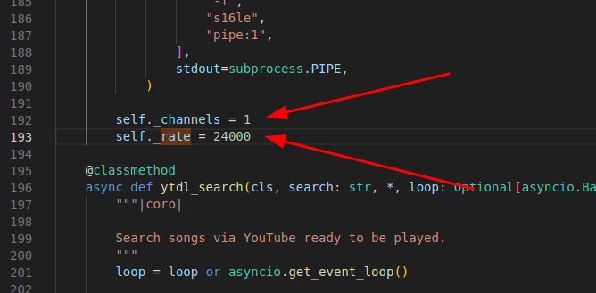

<!-- ABOUT THE PROJECT -->
## About The Project


This is the Twitchbot I use while streaming.
 
Features:
* TTS
* Browser source overlay that represents TTS chatter
* A notification that plays after some time delta between chat iteraction
* Modular twitchio cog system
* Can integrate with [My other project, Terrace Dashboard](https://github.com/sockheadrps/Terrace-Dashboard)

This is definetly still a work in progress, but is useable.

### Terrace Dashboard integration:


### OBS Browser overlay



### Built With
* Bot
  * Python 
  * TwitchIO
  * Websockets (client for OBS overlay)

* OBS Overlay
  * Python (server)
  * Vanilla HTML, CSS, JS


<!-- GETTING STARTED -->
## Getting Started

Tested and used on 3.11.3+

### Prerequisites

Install dependencies.
  ```sh
  pip install -r requirements.txt
  ```
 [Install twitchio[sounds]](https://twitchio.dev/en/latest/exts/sounds.html)

### Installation
create config.py in Twitchbot/Twitchbot and [follow twitchio's documentation for obtaining your access token](https://twitchio.dev/en/development/quickstart.html)

config.py
```
ACCESS_TOKEN = ""
PREFIX = ""
INITIAL_CHANNELS = []
NICK = ""

```

There is currently a bug in TwitchIO that plays the TTS file at the wrong bitrate. Im working on a PR to fix this, but to patch this to work currently some small changes need to be made to 

(Example using a venv in .venv directory)  
Open the "__init__.py" file for twitchio/ext/sounds
```
.venv/lib/python3.11/site-packages/twitchio/ext/sounds/__init__.py
```

## Existing code:


## Patched code:



<!-- ROADMAP -->
## Roadmap

- [ ] Store chat in a database


<!-- CONTRIBUTING -->
## Contributing

Contributions are what make the open source community such an amazing place to learn, inspire, and create. Any contributions you make are **greatly appreciated**.

If you have a suggestion that would make this better, please fork the repo and create a pull request. You can also simply open an issue with the tag "enhancement".
Don't forget to give the project a star! Thanks again!

1. Fork the Project
2. Create your Feature Branch (`git checkout -b feature/AmazingFeature`)
3. Commit your Changes (`git commit -m 'Add some AmazingFeature'`)
4. Push to the Branch (`git push origin feature/AmazingFeature`)
5. Open a Pull Request


<!-- ACKNOWLEDGMENTS -->
## Acknowledgments

Always bouncing ideas off of, and getting help from:
* https://github.com/beaux44


