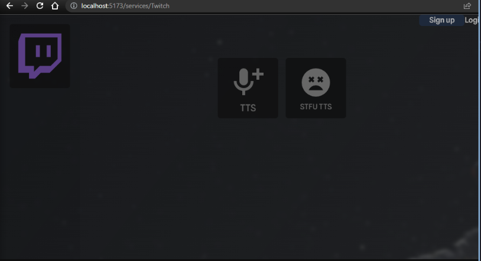

* TTS
* Browser source overlay that represents TTS chatter
* A notification that plays after some time delta between chat iteraction
* Modular twitchio cog system
* Can integrate with [My other project, Terrace Dashboard](https://github.com/sockheadrps/Terrace-Dashboard)


### Terrace Dashboard integration:


### OBS Browser overlay


  ```sh
  pip install -r requirements.txt
  ```
 [Install twitchio[sounds]](https://twitchio.dev/en/latest/exts/sounds.html)

create config.py in Twitchbot/Twitchbot and [follow twitchio's documentation for obtaining your access token](https://twitchio.dev/en/development/quickstart.html)

config.py
```
ACCESS_TOKEN = ""
PREFIX = ""
INITIAL_CHANNELS = []
NICK = ""

```

